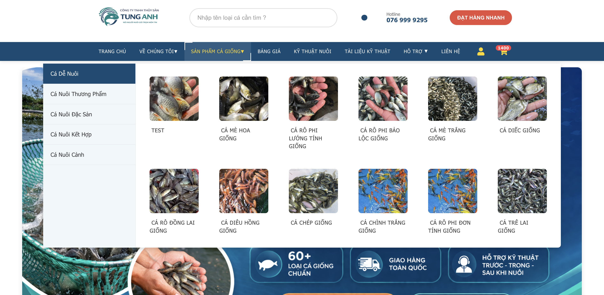

# 👋 Xin chào, tôi là David (Nguyễn Minh Hiếu)

  

## 🚀 Về tôi

-  Hiện tại đang làm việc với **TypeScript, JavaScript, và các công nghệ web hiện đại**
-  Đang học và phát triển kỹ năng về **Full Stack Development**
-  Đam mê xây dựng các ứng dụng web, game, và e-commerce
-  Thích tạo các dự án sáng tạo từ Figma design đến web application
-  Liên hệ: **Nguyenminhhieu06878@gmail.com**

## 🛠️ Công nghệ & Công cụ

### Frontend

### Backend & Tools

## 📊 GitHub Stats

  

## 🏆 GitHub Trophies

  

*Website bán cá giống và thủy sản chất lượng cao*

## 📈 Hoạt động gần đây

<!--START_SECTION:activity-->
<!--END_SECTION:activity-->

## 🔥 Dự án nổi bật

## 📫 Kết nối với tôi

---

  
### 💡 "Code is like humor. When you have to explain it, it's bad." – Cory House

